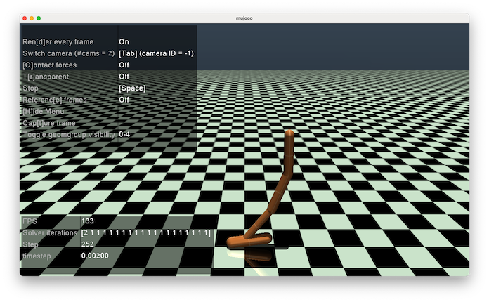
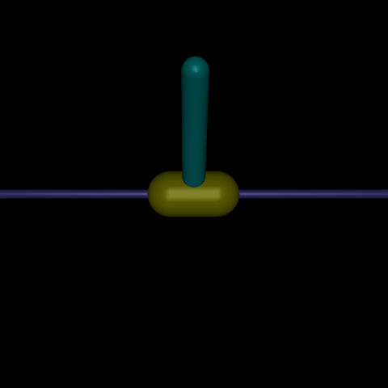

# ICL_ML_PortfolioProject_2024
Portfolio Project for the Imperial College London Machine Learning course, 2024

## Overview
This is project is an agreed departure from the requirements for the portfolio project as specified in the course.

I think I went a bit overboard with the project, taking on quite a large task and going slightly too deep into it. But I’m generally happy with my results given the constraints on time and compute, even if I bit off more than I could really chew.  

Basically I’m trying to teach a simulated jointed figure to walk or hop via reinforcement learning. The figure exists in a physics simulation that computes the figure’s motion according to the torques applied to each of its joints. A neural network monitors the figure and compute how much torque is needed at each joint to make it move without falling over.

My intention was to show I could pull together several different strands of the course and put together a profoundly simple prototype of the kind of system that might be used to train articulated figures for use in computer animation.

The main outcomes from this project are...
- a general system for training neural networks to animate jointed figures using several RL techniques (`GTS` for Gymnasium Training Scheme),
- several neural networks that are trained with that system to animate different jointed figures, with varying degrees of success.

As such I don’t have a data card for any of this, as there was no data to gather or analyse. I do have several models (being the trained networks), and have a [model card](modelcard.md) that covers all those. 

There is also no notebook for this, as notebooks aren’t appropriate for what I was trying to achieve with the project and would have actively gotten in the way, eg: ssh-ing into my linux server to start up a hyper parameter search is not feasible with a notebook.  

### Project Structure
- this README.md, which explains what I did, basic documentation, results and reflections,
- four command line python programs to train, explore and run the neural networks,
- a python module [GTS](GTS) which implements my training system,
- a non technical [write up](docs/GTS_NonTechnicalWriteUp.pdf),
- three folder for the models I trained, along with their hyper parameterisations, example parameter search spaces and example logs,
- a model card of dubious utility given what the models are.

### Relevance Of The Project to My Career
I am a software developer and the main reasons for taking the Imperial ML course were firstly pure interest, but secondly to see if I could apply ML techniques to software I might write. Given my background in digital visual effects, I’m more likely to be writing simulation software for computer animation than a Jupyter notebook for data analytics. I was immediately drawn to the use of reinforcement learning in simulated physical environments as that is much more applicable to my career. So this project is very ‘off-piste’ with respect to the mainstream focus of the course. 

## Installation
**!!I’ve only run this on MacOS and Ubuntu Linux!!**  I have no idea how to install any of this on a Windows machine, the steps below may work, or not. 

### Prerequisite
You must have `Python` 3.12 installed. It also require `make`, but that is installed by default on MacOS and linux.

### Installation Steps For Ubuntu and MacOS
I use a [Makefile](Makefile) to simplify installation. First clone this repo and change into the root directory of the cloned repo.

To make a virtual environment, activate it and install requirements, issue the following command line arguments...
```
make env
source venv/bin/activate
make install-requirements
```

If that worked, you next need to patch a bug in the gymnasium python module that breaks simulation playback.
```
make patch
```

To test it, try the following command,

```
./play.py hopper/worming.checkpoint
```

The first time you run this it may take a minute or, but a window should appear that will run a model on a simulation and it should look like the image below. It will play twice through and quit.




## The Project
For the project I wrote 4 python programs, these are... 

- [train.py](train.py) : which trains a neural network to control a jointed figure,
- [play.py](play.py) : which will run a physics simulation of the neural network controlling a figure,
- [paramSearch.py](paramSearch.py) : which performs hyper parameter searches,
- [info.py](info.py) : which reports information about a trained neural network. 

My [GTS](GTS) module underlies all of these. Along with various supporting code it implements 3 reinforcement learning agents. 
- [REINFORCE](GTS/reinforce.py)
    - with out baselines, with whitening baselines and learned baselines,
- [Advantage Actor Critic (A2C)](GTS/A2C.py)
    - based on the code from [Gymnasium](https://gymnasium.farama.org/tutorials/gymnasium_basics/vector_envs_tutorial/) that was reworked to handle regression problems,
- [Proximal Policy Optimisation (PPO)](GTS/PPO.py)
    - based on code from [openAI](https://github.com/openai/spinningup.git).

I used [Gymnasium](https://gymnasium.farama.org/) for the training environment and physics simulator. It has a range of predefined environments that contain physical models that can be controlled by a neural network. The basic idea is that on a timestep you specify the forces to apply to various parts of the simulated figure, the simulation modifies the figure and its environment according to the laws of physics and an appropriate reward is returned for that action. That reward is used to train a neural network via reinforcement learning so that it can apply the appropriate forces to achieve the require training aims. Rewards can include penalties for falling over and bonuses for moving appropriately.

All the agents use a neural network that generates a [real valued statistical distribution](GTS/stochasticNet.py) to compute the value for each of the controls. During training, the distribution’s range is used for exploration, but when running a simulation the deterministic mean of the distribution is used for the control.

### The Physical Models
I attempted to train neural networks to control three different physical models, with varying degrees of success. I abstracted out the Gymnasium models so that I could modify the reward function as needed. These are simple factory classes, of type [`GTS.PhysicalModel`](GTS/physicalModel.py), which fetch the underlying Gymnasium environment and create a `GTS.Rewarder` to do my own reward computations.

#### The [Inverted Pendulum](GTS/invertedPendulum.py)
This is the simplest model. The idea is to keep the pendulum upright and it has a single control for the force applied to the base of the pendulum. I modified the rewarder so that it penalised motions that were too fast. This helped with convergence in all agents. 



#### The [Hopper](GTS/hopper.py)
The hopper simulates a single leg. The reward is a combination of how fast it is moving forward along with a reward for not falling over. Training episodes stop when it falls over. I modified the rewarder to penalise slow speeds. There are three controls for its joints.


#### The [Walker](GTS/walker.py)
The walker simulates a pair of legs. The reward is a combination of how fast it is moving forward along with a reward for not falling over. Training episodes stop when it falls over. There are six controls for the joints of the legs.


### Training
To train a model you define a [`.spec`](GTS/trainingSpec.py) file which is used by the training program, eg: [invertedA2C.spec](inverted/invertedA2C.spec). This says what model is being trained by which agent and the hyper parameters for that agent. Each agent defines its own set of hyper params, with defaults (look for `_paramSpec` in each of the agents).

For example to train the inverted pendulum with A2C, you can use an existing .spec file as follows...
```
./train.py inverted/invertedA2C.spec trained.checkpoint -e 500 -s 100000 -v
```

This will have the agent run for 500 epochs, with 100000 steps in total with verbose output. The trained agent will be saved in the `trained.checkpoint` file and a score reported.

You can continue running an agent by simply passing a check pointfile in place of a `.spec`. For example...

```
./train.py trained.checkpoint trainedAgain.checkpoint -e 500 -s 100000 -v
```

#### Scoring
After training, I [test](GTS/tester.py) my agents by running them 100 times for 1000 timesteps, randomly initialising the environment each time. The [score](GTS/score.py) was based on the average of those 100 trials and the coefficient of variation among them. 

$$mean = \frac{\sum trials}{|trials|}$$

$$cov = \frac{\sigma(trials)}{mean}$$

$$score = mean * (1 - cov)$$


### Hyper Parameter Search
`paramSearch.py` is used to explore hyper parameter space. It is based on the open source [optuna](https://optuna.org/) hyper parameter framework. You pass the program a [`.space`](GTS/trainingSpace.py) file (see [inverted.space](inverted/inverted.space)) which specifies a model, an agent, fixed hyper parameters for the agent and the parameters that need to be explored. This will run for as many trials as you want, finding the best combination of hyper params according to the score. 

```
./paramSearch.py hopper/hopperA2C.space params.db 20 -n 1 -l hopper/logs
```

This command will explore the space defined in [hopper/hopperA2C.space](hopper/hopperA2C.space), saving values to an sqlite database. It will run 20 trails on 1 CPU. Results will be logged to the directory `hopper/logs`.

Example logs can be found in [hopper/logs/hopperA2C_1](hopper/logs/hopperA2C_1), I didn’t include any checkpoints due to their size. You can see the optuna training log by running a dashboard server...

```
optuna-dashboard sqlite:///hopper/hopperSpace.db 
```

And point a web browser at `http://127.0.0.1:8080/`.


### Running a simulation
`play.py` is used to run a simulation with a neural network controlling the physical simulation in real time. For example...

```
./play.py inverted/invertedReinforce.checkpoint
```

By default the simulation stops on a failure (ie: falling over), to keep the agents playtime use the `-k` option. This is often quite funny for agents that fail.

On MacOS, you have a few hotkeys to control the view, so for example, hitting `TAB` will have the camera follow the figure during the simulation. The mouse can also be used to move the default camera.

## The Results
Given the limited time I had available, the computer resources I had to hand and having to learn several new algorithms, I definitely over extended myself in this project. I’ve implemented the bare bones of the system I imagined and haven’t been able to successfully train neural networks for all models I wanted to. 

#### The Inverted Pendulum
Results are in the folder [inverted](inverted).

The inverted pendulum was the most straightforward to train and I succeeded with all 3 agents, I’ve saved three trained checkpoints, for for each agent. Note that in all cases the pendulum can settle down and appear to stop, the agent is actually making micro-adjustments that aren’t visible. The resulting neural networks can be run with...
```
./play.py inverted/invertedReinforce.checkpoint 
./play.py inverted/invertedPPO.checkpoint 
./play.py inverted/invertedA2C.checkpoint 
```

I have included the training specs for those and several hyperparam spaces that were searched over.)

#### The Hopper
Results are in the folder [hopper](hopper).

Training the hopper was difficult, the right combination of hyper parameters was hard to find and I burned many CPU cycles searching through them. Of the three agents only A2C succeeded, the others produced either comedic results or had the hopper standing upright and not moving as they prioritised rewards for not falling over in preference to moving forward.

The most successful model can be played with,
```
./play.py hopper/hopperA2C.checkpoint
```

I include its training spec [hopper/hopperA2C.spec](hopper/hopperA2C.spec) and one of the hyper parameter spaces I used to train it [hopper/hopperA2C.space](hopper/hopperA2C.space. I’ve also saved the logs and specs of that exploration session in [hopper/logs/hopperA2C_1](hopper/logs/hopperA2C_1). 

I’ve included checkpoints for PPO and REINFORCE, none of which succeeded. You can play these. For comedy value, you can look at a few failures (using the `-k` option to keep the simulation running after the it falls over).
```
./play.py hopper/hopperPPO.checkpoint -k
./play.py hopper/worming.checkpoint -k
```


##### The Walker
Results are in the folder [walker](walker).

I ran out of time and didn’t manage to adequately train the walker. Ironically the only vaguely successful result had the walker hopping on one leg as opposed to walking. It can be run with...
```
./play.py walker/walkerA2C.checkpoint
```

An example of a poor PPO training result, that resembles a stumble, is...
```
./play.py walker/walkerPPOBad.check -k
```

## Reflection
The purpose of my project was bring together strands of the machine learning course to build a prototype system to train simulated models of figures then to use it to train a range of neural networks.

There are existing training systems for Gymnasium, [stable-baseline3](https://github.com/DLR-RM/stable-baselines3) works very well and provides baseline implementations to check your results against. It is orders of magnitude faster and more accurate than what I came up with. However, just using baseline3 to train networks defeats the object of my project. Were I to do this professionally I would look closely at baseline3 and other systems and use that under an appropriate license instead of home brewing it all.

### What I did well
I’m happy with the following...
- the parameterised [regression neural network](GTS/parametricNet.py) and [stochastic neural networks](GTS/stochasticNet.py),
- the general frame work of specifying the hyper parameters to train a neural network,
- the hyper parameter exploration system, 
- the REINFORCE agent, with whitening baseline,
- the A2C agent, it worked best out of all the agents,
- being able to modify rewards more flexibly than you can with gymnasium.

### What I could have done better
- REINFORCE with learned baseline didn’t perform well, I think I did something wrong in my implementation.
- The PPO agent, I’m not sure I’ve implemented it correctly.
- I should have included the number of epochs and number of training steps as hyper parameters to be tuned for PPO and A2C.
- specifying epochs, episodes and total number of steps was a bit of a bodge.

### What I would like to have done
- Implemented more reinforcement learning agents.
- Spent more time tweaking the rewards to improve training and to see what different behaviours I could encourage, especially given the tendency of hopper and walker to prefer not moving. 
- Use a GPU to compute with, hyper parameter exploration was painfully slow, several overnight runs were involved.
- Train networks for more complex figures, I wanted to make the halfCheetah model run and four legged ‘ant’ walk.
